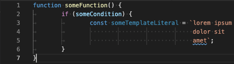
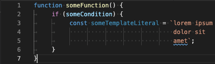
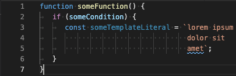
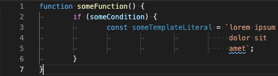
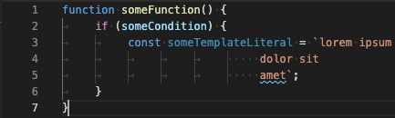
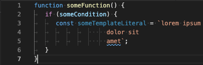

# Dedent Template Literals

This is a Babel plugin that enables you to write properly indented and aligned template literals.

Normally, all whitespace in template literals is significant. This makes it impossible to indent and align the lines of a template literal, because any indentation and alignment is included in the output as well. To be able to keep them out from the output, the subsequent lines of a template literal must be written flush to the first column. This results in ugly looking (unindented and unaligned) code. This plugin is a solution to this problem.

This plugin removes all whitespace until the first column after the opening backtick of a template literal, except on the first line after an interpolation. The "first column after the opening backtick of a template literal" will be referred to as "content start column" in the rest of this document.

```javascript
const httpRFC = `                Hypertext Transfer Protocol -- HTTP/1.1

                 Status of this Memo

                    This document specifies an Internet standards track protocol for the
                    Internet community, and requests discussion and suggestions for
                    improvements.  Please refer to the current edition of the "Internet
                    Official Protocol Standards" (STD 1) for the standardization state
                    and status of this protocol.  Distribution of this memo is unlimited.

                 Copyright Notice

                    Copyright (C) The Internet Society (1999).  All Rights Reserved.`;

console.log(httpRFC);
```

Will print:

```
                Hypertext Transfer Protocol -- HTTP/1.1

Status of this Memo

   This document specifies an Internet standards track protocol for the
   Internet community, and requests discussion and suggestions for
   improvements.  Please refer to the current edition of the "Internet
   Official Protocol Standards" (STD 1) for the standardization state
   and status of this protocol.  Distribution of this memo is unlimited.

Copyright Notice

   Copyright (C) The Internet Society (1999).  All Rights Reserved.
```

First line after an interpolation can start before the content start column. Interpolations can appear anywhere too.

```javascript
function get_HTTP_RFC_for_version(major, minor) {
  if (major != null && minor != null) return `                Hypertext Transfer Protocol -- HTTP/${
              major
        }.${
 minor
                  }

                                              Status of this Memo

                                                This document specifies an Internet standards track protocol for the
                                                Internet community, and requests discussion and suggestions for
                                                improvements.  Please refer to the current edition of the "Internet
                                                Official Protocol Standards" (STD 1) for the standardization state
                                                and status of this protocol.  Distribution of this memo is unlimited.

                                              Copyright Notice

                                                Copyright (C) The Internet Society (1999).  All Rights Reserved.`;
  else throw Error('Version information is missing.');
}

console.log(get_HTTP_RFC_for_version(2,3));
```

In this example, the dot after the first interpolation is not part of any interpolations. It is simply a regular template literal text. Yet, it can appear before the content start column because it is on the first line after an interpolation. This example will be transpiled without any errors and the following will be the output when the transpiled code is run:

```
                Hypertext Transfer Protocol -- HTTP/2.3

Status of this Memo

  This document specifies an Internet standards track protocol for the
  Internet community, and requests discussion and suggestions for
  improvements.  Please refer to the current edition of the "Internet
  Official Protocol Standards" (STD 1) for the standardization state
  and status of this protocol.  Distribution of this memo is unlimited.

Copyright Notice

  Copyright (C) The Internet Society (1999).  All Rights Reserved.
```

However, if a line starts before the content start column _and_ is not the first line after an interpolation, an error will be thrown. Let's say the following file is at `src/httpRFC.js` under your project:

```javascript
function get_HTTP_RFC_for_version(major, minor) {
  if (major != null && minor != null) return `                Hypertext Transfer Protocol -- HTTP/${
              major
        }.${
 minor
                  }

                                              Status of this Memo

                                                This document specifies an Internet standards track protocol for the
                                                Internet community, and requests discussion and suggestions for
                                                improvements.  Please refer to the current edition of the "Internet
                                                Official Protocol Standards" (STD 1) for the standardization state
                                                and status of this protocol.  Distribution of this memo is unlimited.

                                             Copyright Notice

                                                Copyright (C) The Internet Society (1999).  All Rights Reserved.`;
  else throw Error('Version information is missing.');
}

console.log(get_HTTP_RFC_for_version(2,3));
```

In this example, the "Copyright Notice" line is not the first line after an interpolation, yet it starts before the content start column. Hence, the following error will be in the output when running Babel:

```
Error: <path to your project>/src/httpRFC.js: LINE: 16, COLUMN: 46. Line must start at least at column 47.
    at PluginPass.dedentTemplateLiteral (<path to your project>/node_modules/babel-plugin-dedent-template-literals/index.js:39:15)
    at newFn (<path to your project>/node_modules/@babel/traverse/lib/visitors.js:175:21)
    at NodePath._call (<path to your project>/node_modules/@babel/traverse/lib/path/context.js:55:20)
    at NodePath.call (<path to your project>/node_modules/@babel/traverse/lib/path/context.js:42:17)
    at NodePath.visit (<path to your project>/node_modules/@babel/traverse/lib/path/context.js:92:31)
    at TraversalContext.visitQueue (<path to your project>/node_modules/@babel/traverse/lib/context.js:116:16)
    at TraversalContext.visitSingle (<path to your project>/node_modules/@babel/traverse/lib/context.js:85:19)
    at TraversalContext.visit (<path to your project>/node_modules/@babel/traverse/lib/context.js:144:19)
    at Function.traverse.node (<path to your project>/node_modules/@babel/traverse/lib/index.js:82:17)
    at NodePath.visit (<path to your project>/node_modules/@babel/traverse/lib/path/context.js:99:18) {
  code: 'BABEL_TRANSFORM_ERROR'
}
```

## Installation

    npm install --save-dev babel-plugin-dedent-template-literals

## Usage

- [Setup Babel](https://babeljs.io/setup).
- Add `dedent-template-literals` as the first element of the `plugins` array in your [Babel configuration](https://babeljs.io/docs/en/configuration).

## Q&A

### Does this work with tabs?

This plugin already works if you are using only spaces (no tabs). If you are using tabs, this plugin works only if you can answer "yes" to the question: "Will your code still look aligned on not just _some particular_ tab sizes, but on _any arbitrary_ tab size, without making any whitespace changes in the code?"

To be able to answer "yes" to that question, you must be using tabs, and only tabs, for _indentation_, and you must be using spaces, and only spaces, for _alignment_.

The following code is indented with tabs, and only tabs and aligned with spaces, and only spaces.

```
function someFunction() {
	if (someCondition) {
		const someTemplateLiteral = `lorem ipsum
		                             dolor sit
		                             amet`;
	}
}
```

This is how it looks on tab size 8:



On tab size 5:



On tab size 3:



etc.

On every tab size, this code will look proper because it is indented with tabs, and only tabs, and aligned with spaces, and only spaces.

Let's look at another example which is indented with tabs, and only tabs **but** is aligned with both tabs and spaces:

```
function someFunction() {
	if (someCondition) {
		const someTemplateLiteral = `lorem ipsum
					     dolor sit
					     amet`;
	}
}
```

This is how it looks on tab size 8:



On tab size 5:



On tab size 3:



etc.

On every tab size, this code will look different. The only way to make this code look proper on another tab size is to make whitespace changes. This defeats the purpose of using tabs at the first place.

Think of "indentation" as "the whitespace that marks the beginning of a scope", whereas "alignment" as "the whitespace that _comes after indentation_ to make the code look level".

You can find further information on the web if you search for "tabs for indentation, spaces for alignment".
